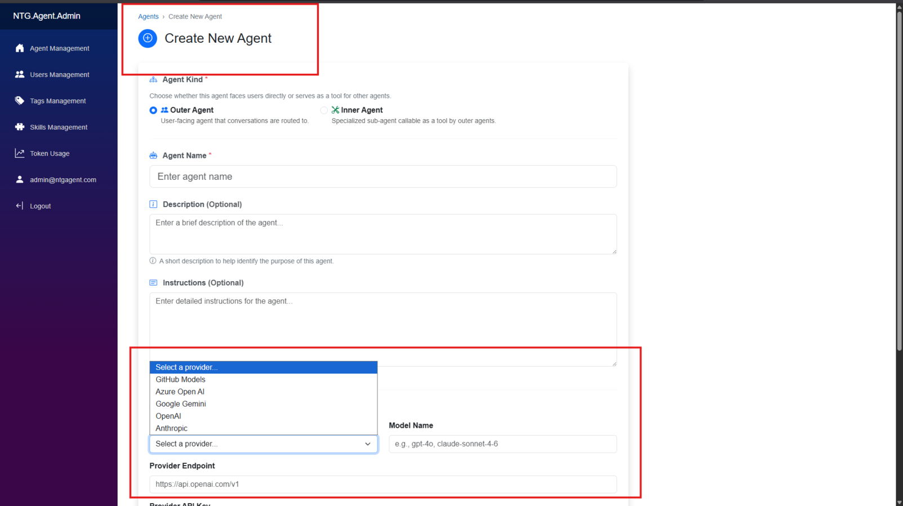
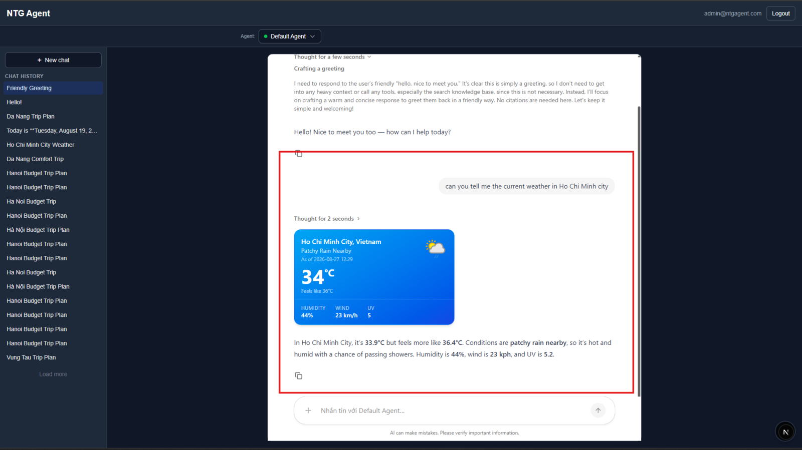

# Part B — Presentation & Demo build plan

Team QUOTA · NTG Agent · OENG1185 Capstone Part B
Vu Gia An · Nguyen Tien · Tran Nguyen Quy Khang · Nguyen Dinh Minh Chau
Supervisor: Tran Nhat Quang · Industry partner: NashTech

Pre-recorded video, hard limit **13:00**, then **6:00** live Q&A on Teams.

This plan is timed to the word. Every spoken line below carries its word count; the budget assumes
**140 words per minute**, which is the realistic rate for this team presenting in English. If a
line grows, something else must shrink.

Order of work: **§2 first** (measure, this week) → §3 (know what you contributed) → §5 (build the
deck) → §6 (record the demo). Do not build slides before §2 produces numbers; four slides depend
on them.

---

## 1. The assessment

| | |
|---|---|
| Slot | 13:00 presentation + demo · 6:00 Q&A · 1:00 transition |
| Video due | **16:00 Sunday 20 Sep 2026** · `.mp4` · OneDrive *SSET Capstone 2026B Presentation*, correct Round folder |
| Canvas due | Mon 21 Sep 2026 23:59 · locks 22 Sep · no late work |
| Filename | `Capstone2025B_NashTech_QUOTA.mp4` — template says `2025B`; **email the coordinator to confirm rather than guess** |
| Live session | All four on Teams, cameras on. Non-participation = 0 for the whole assessment |
| Showcase | Poster, electronic display, both orientations. Non-graded, same zero rule |

### Marks, and what they actually demand

| Criterion | Pts | The demanding clause |
|---|---|---|
| Presentation & explanation | 30 | five named sub-parts: motivation · **methodology/experiment setup** · key technologies · **findings and performance evaluation** · future work |
| Organisation | 10 | logical, coherent, smoothly linked |
| Project demonstration | 40 | *"the audience can grasp all key elements … **even without needing the project demo or explanations by the students**"* |
| Q&A & professionalism | 20 | thorough, confident, **extra insights** on hard questions; dress |

Two clauses drive this whole plan:

- **"Findings and performance evaluation."** A working demo does not satisfy it. Neither do
  lines-of-code or test counts — those are process metrics, and an engineering academic reads
  volume as an input, not an outcome. §2 exists to produce real numbers.
- **"Even without … explanations by the students."** This is a self-sufficiency test. Mute the
  audio, skip the demo, and the figures must still carry the project. Every slide spec in §5
  therefore states what is **on the slide** separately from what is **said**, and the on-slide
  content must stand alone.

---

## 2. Measure first — one afternoon, the largest mark swing available

You are already going to run most of this. §8's checklist requires asking every question in
`demo-scenario.md` §5 three days out. **The only change is writing the score down.**

Report the honest number. *24 of 27, with the three misses characterised* is more credible than
*27 of 27*, and it survives Q&A better.

### 2.1 Retrieval accuracy — the ground-truth set you already have

`demo-scenario.md` §5 is a 27-row ground-truth table: question, correct answer, source document.
Ask all 27 against the right assistant, mark each correct/incorrect, record the total.

> **Result to report:** *"N of 27 policy questions answered correctly against ground truth, across
> four knowledge bases."*

### 2.2 Containment — the measurement nobody has run, and your strongest one

Ask each assistant the questions belonging to *other* assistants' documents. Every one must
decline. 3 outer assistants × ~8 foreign questions ≈ 24 probes.

> **Result to report:** *"24 cross-boundary probes, 0 disclosures."*

This is a **measured security result** and it is direct evidence for the project's central claim.
It converts "we designed a permission boundary" into "we tested it."

### 2.3 Restricted-document reachability

The Compensation Framework sits on an Inner agent. Try to reach it: through every Outer assistant,
through the staff picker, and by URL. Count attempts and successes.

> **Result to report:** *"N direct attempts on the restricted document, 0 reachable."*

### 2.4 Prefetch latency — the claim currently made with no number

`KnowledgePlugin` starts retrieval at request arrival, concurrently with agent construction and
the first model call. It is measurable: run ~30 queries with the prefetch path hit and missed
(a reformulated follow-up misses it), and record time-to-first-token.

> **Result to report:** *"median time to first answer, prefetch hit vs miss, over 30 queries."*
> If you cannot instrument it cleanly in time, **delete every performance adjective about the
> prefetch** from the deck. Do not say "a real latency optimisation" with no figure — that is the
> most attackable sentence available to a marker on the criterion that names performance.

### 2.5 Cost per answer — already instrumented, never used

The platform records tokens and cost per user, session, model, operation and provider. Read it off
after the 27-question run.

> **Result to report:** *"average cost per answered question, at production settings."*

### 2.6 Cold start — currently hand-waved as "up to a minute"

Time one container waking from idle. One number, and it makes the honesty in §6 concrete.

---

## 3. What this team contributed

The repository began **2025-06-24** and has **163 commits**; your four members authored **50** of
them, all from **June 2026 onward**. The top two contributors are NashTech engineers, not team
members. So **do not present "78,000 lines" as team evidence** — the first Q&A question would
dismantle it.

The defensible claim is far better, because every headline capability in the architecture is
yours, by merged pull request:

| Member | Merged contribution |
|---|---|
| **Tran Nguyen Quy Khang** | **Agents-as-tools architecture (#261)** — the Outer/Inner agent model itself · per-provider model management with thinking-mode gating (#287) |
| **An Vu** | **Agent role access control (#277)** — the permission layer · long-term memory (#265) · nightly gitleaks secret scan (#278) · Azure OpenAI reasoning routing fix and two-axis provider client factories (#281) |
| **Nguyen Tien** | **Agent Skills with validated A2UI surface templates bound per agent (#286)** · AG-UI / CopilotKit integration (#264) |
| **Nguyen Dinh Minh Chau** | **LightRAG migration to per-agent VM containers (#282)** |

Read that table against the architecture: the delegation model, the permission layer, the
generated-interface pipeline and the per-agent isolation are **all four** Part B work by this team,
on top of a platform that previously had none of them. That is the contribution sentence, and it
has PR numbers behind it.

**Say it as:** *"We joined an existing open-source platform. Four capabilities on it are ours:
delegation between assistants, the permission layer underneath it, per-assistant document
isolation, and generated interfaces."*

---

## 4. Verified fact sheet

Everything here was checked against the source. **Corrections from the earlier draft are marked ⚠
— the previous wording was wrong and would not have survived an examiner opening one file.**

### 4.1 Scale and stack

| | |
|---|---|
| Repository | 737 tracked files · 78,151 lines C#/Razor · 14 projects · plus ~2.5k TypeScript in the Next.js client (**outside** the C#/Razor total) |
| Runtime | .NET 10 · .NET Aspire · Blazor Server + WASM · Next.js 16 |
| AI layer | Microsoft Agent Framework 1.19 · `Microsoft.Extensions.AI` · MCP |
| Retrieval | LightRAG v1.4.16, one container per agent · Azure OpenAI `gpt-5.1` · `text-embedding-3-large` at 1536-dim |
| Data | SQL Server 2022 · PostgreSQL |
| Tests | ⚠ **607 tests across 35 fixtures — NUnit.** *(Previously written as "500 tests, MSTest". Both wrong: 500 counts only bare `[Test]` and ignores 115 `[TestCase]` rows; the framework is NUnit 4.5.)* |
| CI | SonarCloud analysis with coverage on every PR · gitleaks secret scan nightly **and on every PR** |

⚠ **Do not claim a "70% coverage gate, build fails below."** It is not enforced: the workflow never
passes `sonar.qualitygate.wait=true`, so a failing gate does not fail the build, and no threshold
appears anywhere in `.github/workflows/`. Say *"SonarCloud analysis with coverage on every pull
request"* and nothing more.

⚠ Note if asked about models: the settings class defaults to `gpt-5.4`; the AppHost overrides it to
`gpt-5.1`. Know this before someone greps it.

### 4.2 The four capabilities, stated accurately

**(a) Two kinds of agent.** One `Agents` table, an `AgentKind` discriminator (`Outer = 0`,
`Inner = 1`), and an `AgentInnerAgents` join table. Both `AgentFactory.CreateAgent` overloads and
the chat picker filter on `AgentKind.Outer`, so no chat URL resolves an inner agent.

⚠ **Say "set at creation and not exposed by the update endpoint" — not "immutable."** The update
controller simply never assigns `AgentKind`; there is no guard, no constraint, no test. True in
effect, disprovable as a word.

**(b) Delegation is a permission boundary.** Access is checked twice: when the outer agent's tools
are assembled, and again inside `AgentToolPlugin.AskAsync` at call time. Access requires the agent
to be **published**, and **anonymous users are refused outright** — it is owner, admin, or an
explicit role grant, never a null user. The registration-time filter uses a silent `continue`,
which is exactly why a missing role grant costs the Helpdesk its specialists with no error.

**(c) One retrieval container per agent.** `lightrag-agent-{id}` spawned via Docker.DotNet on a
remote daemon over TLS with a client certificate. Containers publish **no host ports** — there is a
test asserting `PortBindings == null` — and an nginx gateway proxies `/agents/{agentId}/*` to the
container by name. One shared Postgres, isolated per agent by `WORKSPACE = w{agentId:N}`.

⚠ **Three hosted services: a reconciler, an idle-shutdown service, and an ingestion-status poller.**
*(Previously listed a "health probe" as the third — it is a singleton the container manager polls,
not a hosted service.)* Idle timeout is 30 minutes, swept every 5, so worst case a container
survives ~35 minutes. "Warm within 30 minutes" remains the safe instruction.

**(d) Generated interfaces.** AG-UI is the transport (SSE); A2UI v0.9 is the surface language.
Path A: the model composes components against a catalog and calls `render_a2ui`. Path B: a
pre-authored skill template is merged with values via `render_skill_surface`. Skills import as ZIPs
through a validating importer with a documented threat model. The predecessor was one hardcoded
React component matched by tool name — verifiably, `WeatherCardTool.tsx` matches `"get_weather"`.

⚠ A2UI's attribution to Google is correct externally but not evidenced anywhere in the repo. Cite
the spec, not the codebase.

### 4.3 Three things worth mentioning that the old draft missed

- **`A2uiCatalogDriftTests`** re-derives the A2UI catalog from the real npm JSON schema and fails
  when the hand-maintained C# snapshot drifts — self-skipping when `node_modules` is absent so CI
  stays green. A cross-language contract test; the most sophisticated thing in the suite, and
  direct evidence of "advanced knowledge" for the 40-point criterion.
- **Background provisioning with a status state machine** (Provisioning / Ready / Failed, a
  reprovision endpoint, and a refusal to publish an agent that is not Ready). This is *why* demo
  Step 2 does not hang — worth one sentence of narration.
- **OpenTelemetry spans the inner-agent call.** ⚠ This softens the audit-log limitation: the
  delegation is **traced but not persisted as an audit record**. More accurate and less damaging
  than "not logged."

### 4.4 Honest limits — all verified, all real

- **Answer faithfulness has no formal evaluation.** No harness, no test set, no results file
  anywhere in the repo. §2 is what turns this from an empty admission into a bounded one.
- **Delegation is invisible in the UI.** The renderable set is literally `{ "get_weather" }` and
  the Blazor chat discards tool chunks. This is why the demo needs §6.3's on-screen evidence.
- **Handovers are traced, not audit-logged.** Nothing persists the inner-agent call.
- **A broken inner agent breaks the parent's stream.** A missing provider or model throws
  `InvalidOperationException` during tool assembly; the chat path catches only
  `NotSupportedException`, so it escapes mid-stream.
- **The `[1]` citation is produced by one prompt line** — "include citations to the context where
  appropriate." No format, no post-processing, no validator.

---

## 5. The deck — 16 slides, 12:57

Rules applied throughout, from the 40-point self-sufficiency clause:

1. **Every headline is a claim, not a topic.** A topic needs a speaker; a claim does not.
2. **What must be understood is on the slide.** Narration adds colour, never load-bearing fact.
3. **No version numbers, no internals on any slide.** `WORKSPACE`, `Docker.DotNet`, `v1.4.16`,
   "SSE", "o-series" all live in §4 and the appendix, never on screen.
4. **Every term is defined before use** — and that now includes *orchestrator*, *workspace* and
   *faithfulness*, which the previous draft used undefined.

Speaking budget: **140 wpm**. Word counts are given so you can check yourself against a stopwatch.

### 5.0 Images — what we have, and what has to be made

Thirteen screenshots exist in `docs/images/`. **Four earn a place; two need re-shooting; the
architecture diagram must be redrawn; the rest are cut.** A screenshot that needs explaining is
worse than no screenshot, because it spends the audience's attention and gives nothing back.

**Ships as-is (after cropping):**

| File | Slide | Crop to | Why it earns its place |
|---|---|---|---|
| `images/12-CreateAgentScreen.png` | **4** | The form body + the open provider dropdown | Proves "setup is a form" in one frame, and the open dropdown shows all five providers — GitHub Models, Azure OpenAI, Google Gemini, OpenAI, Anthropic — without a word spoken |
| `images/12-CreateAgentScreen.png` | **10** | Just the **Agent Kind** radio block at the top | *"Outer Agent — user-facing… Inner Agent — specialized sub-agent callable as a tool by outer agents"* is the product stating the boundary in its own words. Better evidence than our diagram, because it is not our drawing |
| `images/06-weatherSkillChatScreen.png` | **11** (left) | The weather card + the question above it | The "before": a hand-written component. Genuinely good-looking, which is the point — it took a developer and a release |
| `images/02-tokenTrackScreen.png` | **Appendix A1** | The six summary tiles only | The cost claim needs backing somewhere. ⚠ **Do not put this on a main slide as-is** — the Cost column reads `$0.00` because pricing is not configured, and a marker will notice. Crop to tokens and API calls, label it "usage", and re-shoot after §2.5 if you get real cost data |

**Must be re-shot — the composition is right, the content is not:**

| Shot | For | What to change |
|---|---|---|
| `09-DefaultCVChatScreen.png` + `11-DocumentCVChatScreen.png` | **Demo Step 3** freeze-frame | ⚠ **These contain a real CV** — a real name, a real address, a real IELTS score. `demo-scenario.md` §7 explicitly forbids this: *"Do not substitute a real CV… it will be on screen in front of an examiner panel."* The **composition is exactly right** — same question, two assistants, one declining with `[no-context]`, one answering with `[1]` — so re-shoot that identical pair using the HR and Engineering assistants and the Sao Mai documents |
| `13-AgentManagementScreen.png` | **Appendix A1** | Shows the Outer/Inner tabs, but reads **"Inner Agents 0"**, which contradicts the entire argument. Re-shoot once the five demo agents exist, so it reads Outer 3 / Inner 2 |
| — | **11** (right) | The "after" pane. `03-a2UIRenderScreen.png` is a red circle and a blue letter L — a toy. Screenshot the **trip planner** instead: a business-relevant generated form. Keep `03` only as a fallback, since it does at least show the `render_a2ui` call badge |

**Must be redrawn — do not use the existing one:**

⚠ `ntg-agent-components.png` **is stale and will be caught.** It shows *"Knowledge [Kernel Memory]"*
and a *Vector DB* — the system uses LightRAG containers per agent. It has **no Inner agents**, no
per-agent isolation and no interactive client, so it depicts a system that predates all four of the
team's contributions. Redraw Slide 9 natively in Canva from the spec in that slide. Redrawing also
lets the diagram match Slide 10's and Slide 12's shapes, which is what makes the three read as one
argument.

**Cut, with reasons** — `01-helloscreen` (a greeting; shows nothing) · `04-NoSkillEnableScreen`,
`05-NoWeatherSkillScreen` (negative configuration states; the *absence* of a feature is not a
finding) · `07-AgentSkillScreen`, `08-DefaultKnowledgeSpaceScreen` (internal admin detail at a
level no examiner needs) · `10-DocumentCVScreen` (the upload view; redundant against the answer
shot, and carries the same personal-data problem).

**One rule for every screenshot that survives:** it gets a red callout box and a caption naming
what to look at. Un-annotated screenshots depend on the audience following a cursor, which fails
the "without explanations" test outright.

| # | Slide | Time | Cum. |
|---|---|---|---|
| 1 | Title | 0:12 | 0:12 |
| 2 | Agenda | 0:10 | 0:22 |
| 3 | Three reasons a company assistant stalls | 0:35 | 0:57 |
| 4 | What NashTech needed, and what we claim | 0:35 | 1:32 |
| 5 | Three terms | 0:30 | 2:02 |
| 6 | Where the existing tools stop | 0:30 | 2:32 |
| 7 | Research → three design decisions | 0:30 | 3:02 |
| 8 | **How we worked and how we tested** (new) | 0:35 | 3:37 |
| 9 | The system, in one picture | 0:40 | 4:17 |
| 10 | A boundary you cannot talk your way past | 0:45 | 5:02 |
| 11 | The assistant can answer with a screen | 0:25 | 5:27 |
| 12 | What the demo will prove | 0:20 | 5:47 |
| — | **DEMO** | **4:40** | 10:27 |
| 13 | **What we measured** (new) | 0:45 | 11:12 |
| 14 | **What is ours** (new) | 0:30 | 11:42 |
| 15 | What we would do next | 0:20 | 12:02 |
| 16 | Close | 0:25 | 12:27 |
| — | 4 handovers @ ~7s | 0:30 | **12:57** |

---

### Slide 1 — Title · 0:12 · Member A
**On slide:** `NTG Agent` · *Assistants that answer from your documents, inside your permission
model* · four names · supervisor · NashTech · RMIT Capstone 2026 Part B.
**Say (27 w):** "NTG Agent is a platform for building AI assistants that answer from your own
documents and stay inside your own permission model. I'm [A], with [B], [C] and [D]."

### Slide 2 — Agenda · 0:10
**On slide:** five labels, **no times** — Problem · Research · Design · Demonstration · Results.
**Say (22 w):** "Five parts. The demonstration is the longest, and everything before it exists to
tell you what to look for when you get there."

> Never put per-section times on screen. It hands a marker a stopwatch.

### Slide 3 — Three reasons a company assistant stalls · 0:35
**On slide:** three tiles, each a full sentence that stands alone.
1. **It has never read your documents** — so it answers from the public internet, or invents.
2. **It cannot be pointed at real systems** — it describes a process; it cannot act in one.
3. **Nobody can say who may ask what, or what it cost** — so it never leaves the pilot.

**Say (78 w):** "Every company we spoke to wants an assistant over its own material. Almost none
can safely have one. A general model has never read your policies, so it guesses. It can describe
your deployment process but not touch it. And there is no way to say that Engineering may ask this
and Finance may not — or to see what any of it cost. The third one is why pilots die. Not accuracy.
Governance."

> The previous draft had a fourth tile, "it forgets you." Cut: it is the one failure the product
> does **not** fix, and Slide 15 concedes the memory layer is unfinished. Do not open a promise you
> close with an apology.

### Slide 4 — What NashTech needed, and what we claim · 0:35
**On slide:** left, the need in one sentence — *"Enterprise clients cannot send internal documents
to a public chatbot. They need assistants over their own material, under their own permissions."*
Right, the claim, in a box: **"An administrator configures a governed assistant in a browser. The
boundaries between assistants are enforced by the system, not by instructions to the model."**

**Image:** `images/12-CreateAgentScreen.png`, cropped to the form body with the provider dropdown
open, placed small beneath the claim box. Caption: *"Five AI providers. One form. No code."* It
proves the first half of the claim while the second half is being spoken.

**Say (74 w):** "That is the need NashTech brought us. Our claim is the box on the right, and it has
two halves. First: setting one of these up is a form, not a development task. Second — and this is
the engineering claim — the wall between one assistant and another is built into the system. It is
not a sentence in a prompt asking the model to behave. You will see both."

> This is the contribution, stated as a claim, early. Slide 14 collects on it.

### Slide 5 — Three terms · 0:30 · Member B
**On slide:** three rows — term · plain English · why it matters here. Plus a one-line footer
glossary: *orchestrator = the service that decides which assistant answers · workspace = one
assistant's private store of documents.*

| Term | Plain English | Why it matters |
|---|---|---|
| **Retrieval** | Search your documents first, hand the model the relevant pages | It answers from your material instead of guessing |
| **Assistant as a tool** | One assistant can ask another and use the answer | How a front desk reaches a specialist |
| **Generated interface** | The reply is a working screen, not a paragraph | You can act on the answer |

**Say (62 w):** "Three terms, and I will not redefine them later. Retrieval: we search your
documents and hand the model the relevant pages, so it answers from your material. Assistant as a
tool: one assistant can ask another. Generated interface: sometimes the reply is a working screen
rather than a paragraph. The two words in the footer are the only jargon in the rest of this talk."

> ⚠ MCP was dropped from this slide. It was defined and then never paid off by any demo step — a
> definition with no consequence costs 12 seconds and buys nothing.

### Slide 6 — Where the existing tools stop · 0:30
**On slide:** two comparators only, three criteria. A bar or tick grid, readable at a glance.

| | LangChain / LangGraph | Microsoft Semantic Kernel | **NTG Agent** |
|---|---|---|---|
| Set up by | writing code | writing code | **filling a form** |
| Documents per assistant | one shared pool | one shared pool | **isolated per assistant** |
| Permissions per assistant | build it yourself | build it yourself | **built in** |

**Say (66 w):** "There are four well-known frameworks for this. We are comparing against two,
because they all stop in the same place: every one of them is a library you write code against,
and none of them ships a permission model. If you want an assistant a non-programmer can configure,
with documents that cannot leak between assistants, you build that part yourself. That is the gap
we took."

> Cut from five comparators to two. Five products × five criteria was a 25-cell grid priced at
> 40 seconds and needing 75.

### Slide 7 — Research gave us three decisions · 0:30
**On slide:** three rows, each written out in full — *finding → what we built*.
1. Shared document pools produce inconsistent answers and leakage between assistants → **one
   isolated document store per assistant**.
2. Grounded answers reduce fabrication, but only if the model can decline → **assistants that
   report no context rather than guess**.
3. Prompt-level restrictions are bypassable → **delegation gated by role, checked in code**.

**Say (66 w):** "Three findings changed the design. Shared document pools leak between assistants,
so each of ours gets its own isolated store. Grounding reduces fabrication only if the model is
allowed to say it does not know, so ours decline rather than guess. And restrictions written into
prompts can be talked around — so ours are checked in code, twice, and you will see that tested."

> Three rows, not five, and each one is paid off later: row 1 by Slide 10, row 2 by demo Step 3,
> row 3 by Slide 10 and demo Step 4. No unpaid research rows.
>
> ⚠ The previous draft instructed presenters to *"name two cited sources aloud so the reference
> slides read as load-bearing."* Deleted — that is instructing people to perform rigour. Put the
> citations on the slide in small type and let them be checked.

### Slide 8 — How we worked, and how we tested it · 0:35 — NEW
**On slide:** two halves.
**Left — process:** two-week iterations with the NashTech engineering team · every change by pull
request, reviewed, with automated analysis and a nightly secret scan · 607 automated tests.
**Right — evaluation design:** a fictional 300-person company, four documents, five assistants.
**No document appears on more than one assistant** — one variable, and a built-in control: an
assistant *without* a document must decline the question that document answers.

**Say (80 w):** "Two things about method. We worked in two-week iterations inside NashTech's own
engineering process — every change reviewed as a pull request, with automated analysis and six
hundred and seven tests behind it. And to test the claim, we built a controlled scenario: one
fictional company, four internal documents, five assistants, and no document on more than one
assistant. That last rule is what makes the result mean something, because it gives us a control."

> **This slide did not exist before, and its absence was costing marks directly.** "Methodology and
> experiment setup" is one of five named sub-parts of the 30-point criterion, and the old flow went
> research → architecture with nothing between. The Sao Mai scenario was already a clean
> single-variable design with a negative control; it was just written as stagecraft.

### Slide 9 — The system, in one picture · 0:40 · Member C
**On slide:** the architecture diagram. Three boxes people touch (chat · admin console ·
interactive client) → one orchestrator → what it reaches (five AI providers · one document store
per assistant · connected tools · the record of who asked and what it cost). Label the orchestrator
box with its plain-English definition, on the slide.
**Say (88 w):** "Three things people touch: the chat, the admin console where assistants are set
up, and the interactive client. Everything goes through one service in the middle — that is the
orchestrator. It decides which assistant answers, searches that assistant's documents, calls
whatever tools it is allowed, and records who asked and what it cost. Underneath: five different AI
providers, switchable per assistant, and one separate document store for each assistant. That last
box is the next slide."

> ⚠ The metrics line ("14 projects, 78,000 lines, 500 tests") is **deleted** from this slide. It
> duplicated Slide 13 verbatim, and §3 explains why the line count should not be claimed at all.

### Slide 10 — A boundary you cannot talk your way past · 0:45
Merges the old Slides 9, 10 and 11 — they were the same argument told three times.

**On slide:** one diagram, self-explanatory without narration.
- A person icon connects to two **Outer** assistants. A red crossed line runs from the person to
  two **Inner** assistants below.
- Each of the four assistants has its own document box, drawn separately, labelled *separate store*.
- On the arrow from the Outer assistant down to each Inner one: a padlock captioned
  **"permission checked here — and again here"**.
- Bottom caption, full sentence: **"An assistant's kind is set when it is created. An Inner
  assistant has no chat screen and no address — the only thing that can reach it is another
  assistant that has been granted permission."**

**Image:** `images/12-CreateAgentScreen.png`, cropped to **only** the Agent Kind radio block, in
the corner. It shows the product's own words — *"Outer Agent: user-facing agent that conversations
are routed to / Inner Agent: specialized sub-agent callable as a tool by outer agents"* — which
carries more weight than our diagram, because it is not our drawing. Caption: *"The choice is made
once, here."*

**Say (102 w):** "An assistant is one of two kinds. Outer: a person can chat with it. Inner: only
another assistant can call it, and it has no chat screen and no address at all. The kind is set when
it is created and the edit screen cannot change it. Each assistant's documents sit in a separate
store, so one cannot reach another's — they are not filtered out, they are not there. And when a
front desk asks a specialist, we check permission twice: once when we assemble what it is allowed
to ask, and again at the moment it asks. That is the wall I promised you."

### Slide 11 — The assistant can answer with a screen · 0:25
**On slide:** before/after, as two pictures. Left: *one hand-written screen per tool — new answer,
new code, new release.* Right: *the assistant describes the screen; the app draws it.* Under the
right-hand picture: **"Nobody wrote this screen."**

**Images:** left pane is `images/06-weatherSkillChatScreen.png`, cropped to the weather card alone.
Right pane must be **re-shot**: the trip planner, not `03-a2UIRenderScreen.png` (a red circle and a
blue L reads as a toy to an examiner). The two panes must be the same size — the argument is that
they look equally finished and only one of them cost a developer.

**Say (56 w):** "One more. Before, every visual answer was a screen somebody had written by hand —
a new one meant new code and a release. Now the assistant describes what it wants shown, against a
fixed catalogue of components, and the app draws it. The last thing in the demo is a working form
that nobody wrote."

> ⚠ The previous draft never mentioned this on any slide, while naming it as the project's novelty
> in the Q&A sheet. It was available only if an examiner happened to ask.

### Slide 12 — What the demo will prove · 0:20 · Member D
**On slide — this is the scenario board, and it must be readable alone:** the fictional company,
its three departments, the four documents, and which assistant holds which — drawn as the same
diagram shape as Slide 10 so the audience recognises it. Down the right, five claims numbered to
match the demo steps.
**Say (44 w):** "Here is the setup. One company, four internal documents, five assistants, and no
document on more than one. On the right are the five things the next four minutes will show. Watch
the numbers in the corner of the screen — they match this list."

> The audience previously met the entire scenario cold, mid-demo. They cannot judge whether an
> answer is grounded if they have never seen where the documents live.

---

## 6. The demonstration · 4:40 — the 40-point block

Script, answer sheet and traps: [demo-scenario.md](demo-scenario.md). What follows is the
**recorded** structure, which differs from the live-run script in three ways that matter.

### 6.1 Record it, do not perform it

It is not watched live. Record the demo separately, as many takes as needed, and splice the best
one. Keep a complete unedited run as fallback.

### 6.2 Burn the evidence into the video

Every step carries a **persistent lower-third**: the step number, the claim being proven, and what
to look at. The mapping already exists — it is Slide 12's right-hand column. It must ride on the
video, not be shown once and discarded. This is the single cheapest way to satisfy *"grasp all key
elements without the explanations."*

### 6.3 Step 5 must show its evidence, because the product cannot

The delegation is invisible: the renderable tool set is `{ "get_weather" }` and the chat discards
tool chunks. A working Helpdesk and a **broken** one answering from general knowledge look
identical on screen — our own trap list says so. Narrating a negative over a static screen is the
weakest possible version of the most important minute.

Three fixes, in order of value:

1. **Split screen.** Left: the answer streaming in. Right, held on screen throughout: the
   Helpdesk's Inner Agents tab with both specialists bound, and the staff assistant picker showing
   three assistants, neither specialist among them. The negative claim becomes *visible*, and the
   narration drops from 88 words to about 25.
2. **A trace inset.** Capture the two inner-agent calls from the server trace beforehand and cut in
   a 5-second inset, captioned as a trace rather than the UI. Saying *"the interface does not render
   this yet, so we instrumented it — and making it visible is next on our list"* is a stronger
   engineering answer than the hand-wave it replaces.
3. **A falsification beat.** Ask the Helpdesk something neither specialist can answer, and let it
   decline. A system that declines under the same conditions cannot be answering from general
   knowledge. Ten seconds, and it closes the hole completely.

### 6.4 The five steps

| # | On screen | Time | Claim proven |
|---|---|---|---|
| 1 | The deployed system, signed in, scenario board recapped in the corner | 0:20 | Hosted and running |
| 2 | Configure an assistant: the form, then its Tools, Access and Inner Agents tabs — **then the usage and cost screen** | 1:00 | Setup is a form; capability, permission and cost are settings |
| 3 | Engineering declines the HR question. HR answers **21 days**, cites `[1]`, and the source panel is opened to show the line in the document. Ends on a split-screen freeze, both stores labelled | 1:10 | Grounded, sourced, and genuinely separated |
| | *Compose the Step 3 freeze exactly like the existing `09`/`11` pair — same question, two assistants, one declining with no context, one answering with `[1]`. Re-shoot it with the Sao Mai documents: **the existing pair shows a real CV and cannot be used.*** | | |
| 4 | Helpdesk answers the two-part question with both figures attributed — **split screen per §6.3** — then the falsification beat | 1:25 | Delegation across a permission boundary, with visible evidence |
| 5 | The trip planner form appears; fill a field, change tab, submit | 0:45 | An interface nobody wrote |

**What changed and why:**
- **Old Step 2 (create an assistant from scratch) is compressed into the new Step 2.** It spent
  50 seconds creating an agent and then explicitly skipping the part that matters — *"I'd add the
  documents here, but ingestion takes a minute."* Step 3 opened the admin console anyway.
- **The usage and cost screen is now shown.** Cost was named three times in the old flow — including
  as the sharpest line in Part 1 — and never appeared once. Ten seconds fixes it.
- **The source panel opens in Step 3.** Without it the audience has no way to tell a grounded answer
  from a confident fabrication, which is the exact distinction the step exists to prove.
- **One narration rule:** say the engineering while clicking. On Step 3, *"different store, not a
  filter."* On Step 4, *"it is checking my permission on each specialist before it is allowed to
  ask."* Two sentences; they are what the 40-point criterion means by evidence of advanced
  knowledge.

**Fill the pause.** Two nested calls, possibly cold containers. *"It's asking the first specialist
now, then the second."* Warm every agent within 30 minutes of recording.

---

### Slide 13 — What we measured · 0:45 · Member A — NEW
**On slide:** two columns, numbers large enough to read from the back.

| Measured | Not yet measured |
|---|---|
| **N / 27** ground-truth policy questions correct, across four document sets | **Multi-turn faithfulness at scale** — needs a labelled corpus we did not have time to build |
| **24 cross-boundary probes · 0 disclosures** | **Permanent audit records of delegation** — the calls are traced today, not stored |
| **N direct attempts on the restricted document · 0 reachable** | |
| Median time to first answer: **X s**, prefetch hit vs miss | |
| **607 automated tests**, analysis and a secret scan on every change | |

**Say (95 w):** "We tested the claim rather than asserting it. Twenty-seven policy questions with
known answers, across four document sets. Then the control: we asked every assistant the questions
belonging to the other assistants' documents — twenty-four probes, and not one disclosure. We tried
to reach the restricted salary document directly, every way we could, and could not. Two things we
have not measured. Faithfulness over long conversations needs a labelled set we did not have time to
build, and delegation is traced today but not stored as a permanent record. Both are real gaps."

> **This replaces the old Slides 14 and 16.** They were two consecutive confessions immediately
> before the close, with nothing to calibrate against — "we did not measure" reading exactly as it
> sounds. The same admission placed to the right of five numbers reads as a precise boundary
> instead. Same honesty, opposite effect. Keep the closing line *"both are real gaps"* — it lands
> only now that it follows evidence.
>
> ⚠ Line counts and project counts are **gone** from this slide. They are input metrics, partly
> inherited, and an engineering academic will treat volume as the opposite of a result.

### Slide 14 — What is ours · 0:30 — NEW
**On slide:** four boxes, each naming the capability, the member, and the merged PR number.
- Delegation between assistants — Tran Nguyen Quy Khang — #261
- The permission layer underneath it — Vu Gia An — #277
- One document store per assistant, on our own infrastructure — Nguyen Dinh Minh Chau — #282
- Generated interfaces — Nguyen Tien — #286, #264

Footer, in full: *"We joined an existing open-source platform. These four capabilities are ours."*
**Say (64 w):** "One thing we should be precise about. We did not start from nothing — this is an
existing open-source platform, and we joined it. Four capabilities on it are ours: delegation
between assistants, the permission layer that makes delegation safe, one document store per
assistant on infrastructure we set up, and generated interfaces. Each of them is a reviewed,
merged contribution, and each one is on this list."

> ⚠ The old deck never separated team work from inherited code, while banking 78,000 lines as
> evidence — and had no Q&A answer for *"what did you build?"*, which is the likeliest hard
> question. This turns the deck's biggest exposure into its most concrete slide.

### Slide 15 — What we would do next · 0:20
**On slide:** three items, numbered, each one sentence.
1. **Measure faithfulness properly** — build the labelled set, run it, publish the number. Before
   any new feature.
2. **Store the delegation record** — the calls are traced; make them a permanent audit record.
3. **Finish the memory layer** — the user controls exist; the retrieval behind them does not.

**Say (43 w):** "Three things next, in this order. Measure faithfulness properly, with a labelled
set, before we build anything else. Turn the delegation traces into permanent audit records. And
finish the memory layer — the controls exist, what sits behind them does not yet."

### Slide 16 — Close · 0:25
**On slide:** three sentences, plus the repository link.
1. **You configure an assistant; you do not build one.**
2. **It answers from your documents, shows you where from, and cannot reach anyone else's.**
3. **The wall between assistants is enforced by the system — and we tested it.**

**Say (54 w):** "Three things to take away. You configure one of these; you do not build it. It
answers from your documents, shows you the source, and cannot reach another assistant's. And the
wall between them is enforced by the system rather than requested of the model — which is why we
were able to test it and show you the result. Thank you — happy to take questions."

---

## 7. Q&A · 20 points

Six minutes, all four on camera. The descriptor rewards **extra insight**, so each answer below has
a second sentence that goes one step past the question. Pick a router beforehand: one member
acknowledges each question and names who answers. Pick a backup router too.

| Question | Answer · then the extra step |
|---|---|
| **What did you build, versus what was already there?** | The four capabilities on Slide 14, by PR. · *Extra:* the platform had no delegation, no per-assistant permissions and no per-assistant isolation before Part B; those three interlock, which is why they were taken together. |
| Is the permission check just a prompt instruction? | No — checked when tools are assembled and again at call time in code, and it requires the agent to be published; anonymous users are refused outright. · *Extra:* the registration-time filter is a silent skip, which is a deliberate trade-off we can walk through. |
| How do you know it isn't answering from general knowledge? | Demo Step 4's falsification beat, plus the containment result. · *Extra:* the document figures were chosen to be unguessable — Vietnamese law sets leave at 12 days minimum and our handbook says 18 rising to 24, so a correct answer can only come from the document. |
| How is this different from ChatGPT? | Three assistants, three document sets, three permission groups, one platform. · *Extra:* the difference is not the model — we can switch between five providers per assistant. |
| Can one assistant see another's documents? | No — separate store per assistant, measured at 24 probes, 0 disclosures. · *Extra:* isolation is per-container and per-workspace, so it holds even if the application layer is wrong. |
| How do you stop staff reading the salary bands? | It sits on an Inner assistant: no chat screen, no address, filtered out of the picker in the data layer. · *Extra:* we tried to reach it directly and recorded the result. |
| How accurate is it? | N of 27 against ground truth; faithfulness over long conversations is not yet measured, and that is roadmap item one. · *Extra:* the failure mode we care about is fabrication, not error, which is why the decline behaviour is tested separately. |
| Why LightRAG rather than your own retrieval? | Less code, and it is what made per-assistant isolation practical. · *Extra:* the trade is an operational one — one container per assistant, so there is a cold-start cost we measured. |
| What was the hardest problem? | One real answer each. Suggested: making delegation a permission model rather than a prompt instruction. · *Extra alternative:* the embedding dimension mismatch — the model returns 3072 dimensions, the store expects 1536, and the fix forces truncation at the request. |
| Why does nothing show when it delegates? | The interface renders only one tool type and the chat discards tool chunks. · *Extra:* it **is** traced end to end — the gap is persistence and display, which is roadmap item two. |
| What's actually novel? | The assistant composes its own interface against a catalogue. · *Extra:* the previous approach was one hand-written component per tool, matched by name; there is a contract test that fails if our catalogue drifts from the published schema. |
| Does it scale past a toy? | 607 automated tests, review and analysis on every change, deployed and running. · *Extra:* assistant creation is asynchronous with a provisioning state machine, which is why the UI does not block while a store is built. |
| How do you handle cost? | Recorded per user, session, model, operation and provider — shown in the demo. · *Extra:* we can give cost per answered question from the evaluation run. |
| What would you do differently? | Measure earlier — evaluation should have been built alongside retrieval. · *Extra:* we would also have made delegation observable from the start; not being able to see it shaped how we had to demonstrate it. |

---

## 8. Production checklist

**This week**
- [ ] **Run §2.** All five measurements. Write the numbers into Slide 13. Nothing else blocks on this
- [ ] Confirm the `2025B` filename with the Course Coordinator by email
- [ ] Assign real names to Members A–D in §5

**A week out**
- [ ] Demo environment per demo-scenario.md §6 — five agents, four documents, Inner agents published **then** bound, Default Agent unpublished, every agent has a provider *and* model
- [ ] Deck built to §5. Check every slide against the mute test: cover the notes, read only the slide — is the point still there?
- [ ] **Images per §5.0:** crop `12` twice and `06` once · re-shoot the grounding pair with Sao Mai documents · re-shoot the trip planner · re-shoot the agent list showing Outer 3 / Inner 2 · redraw the architecture diagram in Canva
- [ ] **Delete `ntg-agent-components.png` from the deck folder** so nobody reaches for it under time pressure — it shows Kernel Memory and no Inner agents
- [ ] Every surviving screenshot has a red callout box and a caption
- [ ] Poster, both orientations

**Three days out**
- [ ] Full read-through against a stopwatch, **per slide**, not just the total. Any slide over its line: cut words, not pace
- [ ] Lower-third captions cut for all five demo steps
- [ ] Step 4 split-screen composition tested

**Two days out — record**
- [ ] Warm every agent within 30 minutes of recording
- [ ] Record the demo separately; keep an unedited full run as fallback
- [ ] Record narration; splice; level the four voices
- [ ] **Play the exported `.mp4` end to end** — slides legible, every voice audible, captions correct

**Sunday before 16:00**
- [ ] Upload · correct Round folder · correct filename · email the coordinator · submit on Canvas

**Monday**
- [ ] Four on Teams, cameras on, professional dress agreed in advance — not "business casual", agree the actual standard
- [ ] Member D on camera for the Slide 12 intro at minimum; the demo is spliced, so D must otherwise appear
- [ ] Fallback recording, answer cheat sheet and §2 numbers on a second screen

---

## 9. Risks

| Risk | Mitigation |
|---|---|
| **The deck runs long** — the previous version was 40% over budget | Word counts in §5 are the control. Rehearse per slide against a stopwatch, and cut words rather than speed up |
| Demo fails while recording | Recorded separately and spliced; unedited fallback exists |
| Cold containers cause dead air | Warm within 30 min; narrate the pause; §2.6 gives you the real number |
| Helpdesk silently loses its specialists | Present as Admin or grant the roles — it fails with **no error** |
| A broken inner agent kills the parent's stream | Verify every agent has a provider *and* model before recording |
| An examiner checks a claim | §4 is verified against source. Do not reintroduce "500 tests", "MSTest", "70% coverage gate", "immutable", or "78,000 lines" as team output |
| **A real CV appears on screen** | The existing grounding screenshots contain one. Re-shoot with Sao Mai documents; delete the originals from the deck folder |
| **The stale architecture diagram gets used** | It shows Kernel Memory and no Inner agents — i.e. the system *before* this team's work. Redraw it, and remove the old file from reach |
| "What did you actually build?" | Slide 14, with PR numbers |
| §2 does not get done | Then delete every performance adjective from the deck and say plainly that evaluation is future work. Do not present unmeasured claims as findings |
